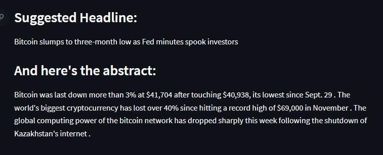

# Extractive-Summary-and-Keywords-of-Financial-News
A webapp to extract summary and important keywords in  news text using HuggingFace transformers.

## Sample Input:
### source: [News Article from Reuters](https://www.reuters.com/markets/stocks/bitcoin-slumps-lowest-since-september-2022-01-07/) 
LONDON, Jan 7 (Reuters) - Bitcoin slumped as much as 5% on Friday to its lowest since late September, amid a broader sell-off for cryptocurrencies driven by concerns about tighter U.S. monetary policy. Bitcoin was last down more than 3% at $41,704 after touching $40,938, its lowest since Sept. 29, as a mixed bag of U.S. payrolls data fuelled some bargain buying. The world's biggest cryptocurrency has lost over 40% since hitting a record high of $69,000 in November and the volatility that has plagued it since its birth 13 years ago remains stubbornly present. The global computing power of the bitcoin network has dropped sharply this week following the shutdown of Kazakhstan's internet as an uprising hit the country's fast-growing cryptocurrency mining industry. Bitcoin has also been under pressure after minutes from the latest U.S. Federal Reserve meeting, released on Wednesday, appeared to lean toward more aggressive policy action, sapping investor appetite for riskier assets. "We are seeing broad risk-off sentiment across all markets currently as inflationary concerns and rate hikes appear to be at the forefront of speculators' minds," said Matthew Dibb, COO of Singapore crypto platform Stack Funds. "Liquidity in BTC has been quite thin on both sides and there is risk of a retreat back to the mid-30's on the short term." Ether , the second largest token by market cap, fell as much as 8.6% to $3,114, its lowest since Oct. 1. It was last trading down more than 6% at $3,200.

## Model Suggested Headline:
Bitcoin slumps to three-month low as Fed minutes spook investors

## Actual Headline:
Bitcoin hovers near more than 3-month lows after U.S. payrolls

## Model Generated Summary:
Bitcoin was last down more than 3% at $41,704 after touching $40,938, its lowest since Sept. 29 . The world's biggest cryptocurrency has lost over 40% since hitting a record high of $69,000 in November . The global computing power of the bitcoin network has dropped sharply this week following the shutdown of Kazakhstan's internet .

## Model Suggested Keywords:

